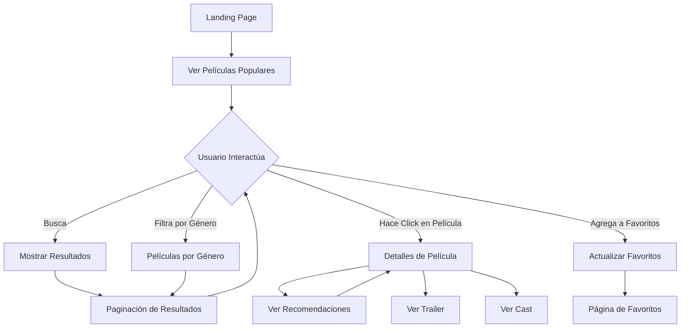

# QuickBet Movies - Documentación Técnica Completa

## Índice
1. [Descripción General del Proyecto](#descripción-general-del-proyecto)
2. [Arquitectura del Sistema](#arquitectura-del-sistema)
3. [Stack Tecnológico](#stack-tecnológico)
4. [Estructura del Proyecto](#estructura-del-proyecto)
5. [Integración con API TMDB](#integración-con-api-tmdb)
6. [Gestión de Estado](#gestión-de-estado)
7. [Arquitectura de Componentes](#arquitectura-de-componentes)
8. [Estrategias de Renderizado](#estrategias-de-renderizado)
9. [Optimizaciones de Performance](#optimizaciones-de-performance)
10. [Flujos de Usuario](#flujos-de-usuario)
11. [Manejo de Errores](#manejo-de-errores)
12. [Testing y Calidad de Código](#testing-y-calidad-de-código)
13. [Deployment y Configuración](#deployment-y-configuración)

---

## Descripción General del Proyecto

**QuickBet Movies** es una aplicación web moderna de catálogo de películas que simula una plataforma tipo Netflix/streaming. Desarrollada como prueba técnica, utiliza la API de TMDB (The Movie Database) para proporcionar una experiencia completa de descubrimiento y navegación de películas.

### Características Principales
- 📱 **Responsive Design**: Adaptable a desktop, tablet y móvil
- 🔍 **Búsqueda en Tiempo Real**: Con debounce automático
- 🎬 **Catálogo Completo**: Películas populares, trending, por género
- ⭐ **Sistema de Favoritos**: Persistente en localStorage
- 🎭 **Detalles Enriquecidos**: Información completa, trailers, casting
- 🔄 **Paginación Inteligente**: Navegación fluida entre páginas
- 🎨 **UI/UX Moderna**: Diseño inspirado en plataformas de streaming

---

## Arquitectura del Sistema

### Filosofía Arquitectónica

La aplicación sigue una **arquitectura modular y escalable** basada en principios de:

1. **Separación de Responsabilidades**: Cada capa tiene una función específica
2. **Reutilización de Componentes**: Basado en Atomic Design
3. **Gestión Centralizada del Estado**: React Query para server state, Context API para client state
4. **Tipado Estricto**: TypeScript para mayor robustez
5. **Performance First**: Optimizaciones en cada nivel

### Capas de la Aplicación

```
┌─────────────────────────────────────────┐
│              UI LAYER                   │
│  ┌─────────────────────────────────┐   │
│  │    Components (Atomic Design)   │   │
│  │  Atoms → Molecules → Organisms  │   │
│  └─────────────────────────────────┘   │
└─────────────────────────────────────────┘
┌─────────────────────────────────────────┐
│            BUSINESS LAYER               │
│  ┌─────────────┐  ┌─────────────────┐  │
│  │   Hooks     │  │   Providers     │  │
│  │ (Logic)     │  │  (Context)      │  │
│  └─────────────┘  └─────────────────┘  │
└─────────────────────────────────────────┘
┌─────────────────────────────────────────┐
│             DATA LAYER                  │
│  ┌─────────────┐  ┌─────────────────┐  │
│  │  Services   │  │  React Query    │  │
│  │   (HTTP)    │  │   (Cache)       │  │
│  └─────────────┘  └─────────────────┘  │
└─────────────────────────────────────────┘
┌─────────────────────────────────────────┐
│           EXTERNAL LAYER                │
│           TMDB API + Next.js            │
└─────────────────────────────────────────┘
```

---

## Stack Tecnológico

### Core Framework
- **Next.js 15.4.4**: Framework React con App Router
- **React 19.1.0**: Biblioteca de UI con las últimas features
- **TypeScript 5.x**: Tipado estático estricto

### Gestión de Estado y Datos
- **TanStack Query v5.83.0**: Server state management
- **Context API**: Client state (favoritos, sidebar)
- **Axios 1.11.0**: Cliente HTTP con interceptors

### Styling y UI
- **Tailwind CSS v4**: Framework CSS utility-first
- **Radix UI**: Componentes base accesibles
- **Lucide React**: Librería de iconos
- **IBM Plex Sans**: Tipografía del proyecto

### Herramientas de Desarrollo
- **ESLint**: Linting con reglas estrictas
- **Prettier**: Formateo automático de código
- **TypeScript**: Configuración strict
- **Yarn**: Gestor de paquetes

### API Externa
- **TMDB API v3**: The Movie Database
- **Bearer Token**: Autenticación segura

---

## Estructura del Proyecto

### Organización de Directorios

```
src/
├── app/                          # Next.js App Router
│   ├── layout.tsx               # Layout raíz con providers
│   ├── page.tsx                 # Home page (SSR)
│   ├── loading.tsx              # Loading UI global
│   ├── error.tsx                # Error boundary global
│   ├── favorites/               # Página de favoritos
│   │   └── page.tsx
│   └── movie-details/           # Detalles de película
│       └── [id]/
│           ├── page.tsx         # SSG con generateStaticParams
│           ├── loading.tsx      # Loading específico
│           └── error.tsx        # Error específico
│
├── components/                   # Atomic Design Components
│   ├── atoms/                   # Elementos básicos
│   │   ├── favorite-button/     # Botón de favoritos
│   │   ├── navigation-link/     # Enlaces de navegación
│   │   └── rating-circle/       # Círculo de rating
│   ├── molecules/               # Combinaciones simples
│   │   ├── auth-modal/          # Modal de autenticación
│   │   ├── hero-banner/         # Banner principal
│   │   ├── movie-card/          # Tarjeta de película
│   │   ├── navbar/              # Barra de navegación
│   │   └── sidebar/             # Barra lateral
│   ├── organisms/               # Componentes complejos
│   │   ├── home-page-client/    # Cliente de home
│   │   ├── movie-details-hero/  # Hero de detalles
│   │   ├── movies-grid/         # Grid de películas
│   │   └── movie-recommendations/ # Recomendaciones
│   ├── templates/               # Layouts de página
│   │   └── main-layout/         # Layout principal
│   └── ui/                      # Componentes base (Radix)
│       ├── dialog.tsx
│       └── select.tsx
│
├── hooks/                       # Custom React Hooks
│   ├── api/                     # Hooks para API
│   │   ├── useMovies.ts         # Hooks de películas
│   │   ├── useSearch.ts         # Hooks de búsqueda
│   │   ├── useGenres.ts         # Hooks de géneros
│   │   └── useInfiniteQueries.ts # Scroll infinito
│   ├── useFavorites.tsx         # Hook de favoritos
│   └── useSidebarState.ts       # Estado del sidebar
│
├── lib/                         # Librerías core
│   ├── api.ts                   # Cliente Axios + utils
│   └── utils.ts                 # Utilidades generales
│
├── providers/                   # Context Providers
│   ├── QueryProvider.tsx        # React Query setup
│   ├── SidebarProvider.tsx      # Estado del sidebar
│   └── index.ts                 # Exportaciones
│
├── services/                    # HTTP Services
│   ├── movies.service.ts        # Servicio de películas
│   ├── genres.service.ts        # Servicio de géneros
│   ├── search.service.ts        # Servicio de búsqueda
│   └── index.ts                 # Exportaciones
│
├── types/                       # TypeScript Types
│   ├── api.ts                   # Tipos base de API
│   └── movie.ts                 # Tipos específicos
│
└── utils/                       # Utilidades auxiliares
```

### Convenciones de Nombrado

- **Carpetas**: `kebab-case` (ej: `movie-card`, `hero-banner`)
- **Archivos**: `camelCase.extension` (ej: `useMovies.ts`)
- **Componentes**: `PascalCase` (ej: `MovieCard`, `HeroBanner`)
- **Hooks**: `camelCase` con prefijo `use` (ej: `useMovies`)
- **Services**: `camelCase` con sufijo `.service` (ej: `movies.service.ts`)

---

## Integración con API TMDB

### Cliente HTTP Base

```typescript
// src/lib/api.ts
export const api = axios.create({
  timeout: 50000,
  baseURL: 'https://api.themoviedb.org/3',
  headers: {
    'Content-Type': 'application/json',
    Authorization: `Bearer ${process.env.NEXT_PUBLIC_TMDB_ACCESS_TOKEN}`,
  },
});
```

### Interceptors y Middleware

**Request Interceptor**:
- Añade idioma por defecto (`en-US`)
- Normaliza parámetros de consulta

**Response Interceptor**:
- Manejo centralizado de errores 401
- Logging de errores de autenticación

### Servicios por Dominio

#### Movies Service (`src/services/movies.service.ts`)
```typescript
export const moviesService = {
  getPopular: (page: number = 1) => Promise<TMDBPaginatedResponse<Movie>>,
  getNowPlaying: (page: number, region: string) => Promise<...>,
  getUpcoming: (page: number, region: string) => Promise<...>,
  getTopRated: (page: number) => Promise<...>,
  getTrending: (timeWindow: 'day' | 'week') => Promise<...>,
  getDetails: (movieId: number, appendToResponse?: string) => Promise<MovieDetails>,
  discoverMovies: (filters?: MovieFilters) => Promise<...>,
  getByGenre: (genreId: number, page: number, sortBy: string) => Promise<...>,
  getRecommendations: (movieId: number, page: number) => Promise<...>,
  getSimilar: (movieId: number, page: number) => Promise<...>,
  getVideos: (movieId: number) => Promise<TMDBVideosResponse>,
  getCredits: (movieId: number) => Promise<TMDBCreditsResponse>,
};
```

#### Genres Service (`src/services/genres.service.ts`)
- Obtención de géneros de películas
- Cache de 24 horas por estabilidad

#### Search Service (`src/services/search.service.ts`)
- Búsqueda de películas
- Búsqueda múltiple (movies, TV, personas)
- Debounce automático integrado

### Utilidades de Imágenes

```typescript
export const imageUtils = {
  getPosterUrl: (path: string | null, size = 'w500') => string | null,
  getBackdropUrl: (path: string | null, size = 'w1280') => string | null,
};

// Tamaños disponibles:
// Posters: w92, w154, w185, w342, w500, w780, original
// Backdrops: w300, w780, w1280, original
```

---

## Gestión de Estado

### Arquitectura de Estado

La aplicación utiliza una **arquitectura híbrida** de gestión de estado:

1. **Server State**: React Query (TanStack Query)
2. **Client State**: Context API + useState
3. **Local Storage**: Favoritos y preferencias

### Server State con React Query

#### Configuración del QueryClient

```typescript
// src/providers/QueryProvider.tsx
new QueryClient({
  defaultOptions: {
    queries: {
      staleTime: 1000 * 60 * 5,        // 5 minutos
      gcTime: 1000 * 60 * 10,          // 10 minutos
      retry: (failureCount, error) => {
        // No retry para errores 401/403
        if (error?.response?.status === 401 || error?.response?.status === 403) {
          return false;
        }
        return failureCount < 3;
      },
      refetchOnWindowFocus: false,
      refetchOnMount: true,
      refetchOnReconnect: true,
    },
    mutations: {
      retry: 1,
    },
  },
});
```

#### Estrategias de Cache por Tipo de Datos

| Tipo de Datos | Stale Time | GC Time | Justificación |
|---------------|------------|---------|---------------|
| **Géneros** | 24 horas | 48 horas | Datos estáticos, raramente cambian |
| **Trending** | 5 min (day) / 6h (week) | 15 min / 12h | Frecuencia de actualización variable |
| **Búsquedas** | 5 minutos | 10 minutos | Resultados temporales |
| **Detalles** | 1 hora | 2 horas | Contenido estable |
| **Listas** | 15 minutos | 30 minutos | Balance actualización/rendimiento |

#### Query Keys Pattern

```typescript
export const MOVIE_QUERY_KEYS = {
  all: ['movies'] as const,
  popular: (page: number) => [...MOVIE_QUERY_KEYS.all, 'popular', page] as const,
  details: (id: number) => [...MOVIE_QUERY_KEYS.all, 'details', id] as const,
  byGenre: (genreId: number, page: number) => 
    [...MOVIE_QUERY_KEYS.all, 'byGenre', genreId, page] as const,
  // ... más keys
};
```

### Client State con Context API

#### Favorites Context

```typescript
interface FavoritesContextType {
  favorites: Movie[];
  addToFavorites: (movie: Movie) => void;
  removeFromFavorites: (movieId: number) => void;
  isFavorite: (movieId: number) => boolean;
  toggleFavorite: (movie: Movie) => void;
  clearFavorites: () => void;
  favoritesCount: number;
}
```

**Características**:
- Persistencia automática en localStorage
- Prevención de duplicados
- API intuitiva para componentes
- Manejo de errores robusto

#### Sidebar Context

Manejo del estado del sidebar con:
- Query de búsqueda
- Género seleccionado
- Estado de visibilidad
- Sincronización entre componentes

### Hooks Personalizados

#### usePopularMovies

```typescript
export const usePopularMovies = (
  page: number = 1,
  initialData?: TMDBPaginatedResponse<Movie>
) => {
  return useQuery({
    queryKey: MOVIE_QUERY_KEYS.popular(page),
    queryFn: () => moviesService.getPopular(page),
    initialData: page === 1 && initialData 
      ? { data: initialData } 
      : undefined,
    staleTime: 1000 * 60 * 15,
    gcTime: 1000 * 60 * 30,
  });
};
```

#### useMovieSearch (con Debounce)

```typescript
export const useMovieSearch = (query: string, page: number = 1) => {
  const [debouncedQuery] = useDebounce(query, 300);
  
  return useQuery({
    queryKey: SEARCH_QUERY_KEYS.movies(debouncedQuery, page),
    queryFn: () => searchService.searchMovies(debouncedQuery, page),
    enabled: debouncedQuery.length >= 2,
    staleTime: 1000 * 60 * 5,
  });
};
```

---

## Arquitectura de Componentes

### Atomic Design Implementation

La aplicación implementa **Atomic Design** de manera estricta, organizando componentes en una jerarquía clara:

#### Atoms (Elementos Básicos)

**FavoriteButton** (`src/components/atoms/favorite-button/`)
```typescript
interface FavoriteButtonProps {
  movie: Movie;
  size?: number;
  className?: string;
}
```
- Botón interactivo para gestionar favoritos
- Integración directa con `useFavorites`
- Animaciones suaves y feedback visual
- Estados: normal, hover, favorito

**RatingCircle** (`src/components/atoms/rating-circle/`)
```typescript
interface RatingCircleProps {
  rating: number;
  size?: number;
  strokeWidth?: number;
  showAnimation?: boolean;
}
```
- Círculo SVG animado para mostrar rating
- Colores dinámicos basados en puntuación
- Optimizado para diferentes tamaños
- Animación opcional de progreso

**NavigationLink** (`src/components/atoms/navigation-link/`)
- Enlaces de navegación con estados activos
- Integración con Next.js router
- Accesibilidad mejorada

#### Molecules (Combinaciones Simples)

**MovieCard** (`src/components/molecules/movie-card/`)
```typescript
interface MovieCardProps {
  movie: Movie;
  className?: string;
  onClick?: (movie: Movie) => void;
}
```
- Tarjeta completa de película
- Imagen optimizada con Next.js Image
- Rating y favoritos integrados
- Hover effects y transiciones
- Click handler para navegación

**HeroBanner** (`src/components/molecules/hero-banner/`)
- Banner principal de la aplicación
- Imagen de fondo dinámica
- Overlay con gradiente
- Información destacada de película

**Navbar** (`src/components/molecules/navbar/`)
- Navegación principal de la aplicación
- Logo y links principales
- Responsive design
- Estado activo de rutas

**Sidebar** (`src/components/molecules/sidebar/`)
- Barra lateral con filtros
- Lista de géneros
- Búsqueda integrada
- Estado colapsable en móvil

#### Organisms (Componentes Complejos)

**MoviesGrid** (`src/components/organisms/movies-grid/`)
```typescript
interface MoviesGridProps {
  movies: Movie[];
  title: string;
  isLoading: boolean;
  error: Error | null;
  currentPage: number;
  totalPages: number;
  onPageChange: (page: number) => void;
  onMovieClick: (movie: Movie) => void;
}
```
- Grid responsivo de películas
- Paginación integrada
- Estados de loading y error
- Skeleton loading
- Manejo de eventos de click

**HomePageClient** (`src/components/organisms/home-page-client/`)
- Lógica principal de la página home
- Gestión de múltiples queries (popular, género, búsqueda)
- Switching inteligente entre estados
- Memoización para performance

**MovieDetailsHero** (`src/components/organisms/movie-details-hero/`)
- Hero section de detalles de película
- Información completa (géneros, duración, etc.)
- Trailer embedido
- Cast principal
- Botones de acción

**MovieRecommendations** (`src/components/organisms/movie-recommendations/`)
- Carrusel de películas recomendadas
- Filtrado por géneros similares
- Scroll horizontal
- Loading states

#### Templates (Layouts)

**MainLayout** (`src/components/templates/main-layout/`)
```typescript
interface MainLayoutProps {
  children: React.ReactNode;
  className?: string;
}
```
- Layout principal con sidebar
- Responsive grid system
- Gestión de estado del sidebar
- Consistent spacing y margins

### Patrones de Componentes

#### Container/Presentational Pattern

Los organismos siguen el patrón **Container/Presentational**:

- **Container**: Maneja lógica, estado, y side effects
- **Presentational**: Se enfoca en UI y props

#### Compound Components Pattern

Algunos componentes complejos utilizan **Compound Components**:

```typescript
// Ejemplo conceptual
<MoviesGrid>
  <MoviesGrid.Header title="Popular Movies" />
  <MoviesGrid.Content movies={movies} />
  <MoviesGrid.Pagination currentPage={1} totalPages={10} />
</MoviesGrid>
```

#### Error Boundaries

Implementación de error boundaries en múltiples niveles:
- Global: `app/error.tsx`
- Por página: `app/movie-details/[id]/error.tsx`
- Por componente: Componentes críticos tienen try/catch

---

## Estrategias de Renderizado

### Next.js App Router Implementation

La aplicación aprovecha **Next.js 15.4.4 con App Router** para implementar diferentes estrategias de renderizado según las necesidades de cada página.

#### Server-Side Rendering (SSR)

**Home Page** (`src/app/page.tsx`)
```typescript
export default async function HomePage() {
  let initialPopularMovies: TMDBPaginatedResponse<Movie> | undefined;

  try {
    const response = await moviesService.getPopular(1);
    initialPopularMovies = response.data;
  } catch (error) {
    console.error('Error al obtener películas populares:', error);
  }

  return (
    <MainLayout>
      <HomePageClient initialPopularMovies={initialPopularMovies} />
    </MainLayout>
  );
}
```

**Beneficios**:
- **SEO Optimizado**: Contenido indexable desde el primer load
- **Performance Inicial**: Datos pre-cargados desde el servidor
- **UX Mejorada**: Contenido visible inmediatamente
- **Hydration Optimizada**: React Query recibe initial data

#### Static Site Generation (SSG)

**Movie Details** (`src/app/movie-details/[id]/page.tsx`)
```typescript
export async function generateStaticParams() {
  try {
    const response = await moviesService.getPopular(1);
    const movies = response.data.results;
    
    // Pre-generar las 20 películas más populares
    return movies.slice(0, 20).map((movie: Movie) => ({
      id: movie.id.toString(),
    }));
  } catch (error) {
    console.error('Error generating static params:', error);
    return [];
  }
}

export default async function MovieDetailsPage({ params }: PageProps) {
  const { id } = await params;
  let movie: MovieDetails | null = null;

  try {
    const response = await moviesService.getDetails(Number(id));
    movie = response.data;
  } catch (error) {
    console.error('Error al obtener detalles de película:', error);
  }

  // ... resto del componente
}
```

**Características**:
- **Build Time Generation**: Las páginas más populares se pre-generan
- **Fallback Strategy**: ISR para páginas no pre-generadas
- **Performance Extrema**: Tiempo de carga casi instantáneo
- **SEO Perfecto**: Contenido completamente estático

#### Client-Side Rendering (CSR)

**Componentes Interactivos**
```typescript
'use client';

export const HomePageClient: React.FC<HomePageClientProps> = ({
  initialPopularMovies,
}) => {
  // Lógica de cliente para interactividad
  const { searchQuery, selectedGenreId } = useSidebarContext();
  const { data: popularMoviesData } = usePopularMovies(1, initialPopularMovies);
  
  // ... resto del componente
};
```

**Uso estratégico**:
- **Interactividad**: Búsqueda, filtros, favoritos
- **Estado Dinámico**: Componentes que necesitan estado del cliente
- **Optimistic Updates**: Feedback inmediato para acciones de usuario

### Optimización de Renderizado

#### React.memo y useMemo

```typescript
// Memoización de componentes pesados
export const MovieCard = React.memo<MovieCardProps>(({ movie, onClick }) => {
  const posterUrl = useMemo(
    () => movie.poster_path 
      ? imageUtils.getPosterUrl(movie.poster_path, 'w342')
      : '/placeholder-movie.jpg',
    [movie.poster_path]
  );

  // ... resto del componente
});

// Memoización de cálculos complejos
const { movies, isLoading, error, totalPages, title } = useMemo(() => {
  if (searchQuery && searchQuery.length >= 2) {
    return {
      movies: searchMoviesData?.data?.results || [],
      isLoading: searchLoading,
      error: searchError,
      totalPages: searchMoviesData?.data?.total_pages || 1,
      title: `Search Results for "${searchQuery}"`,
    };
  }
  // ... lógica adicional
}, [searchQuery, searchMoviesData, /* ... otras dependencias */]);
```

#### Lazy Loading de Componentes

```typescript
// Lazy loading para componentes no críticos
const AuthModal = lazy(() => 
  import('@/components/molecules/auth-modal').then(module => ({
    default: module.AuthModal
  }))
);

// Uso con Suspense
<Suspense fallback={<AuthModalSkeleton />}>
  <AuthModal />
</Suspense>
```

---

## Optimizaciones de Performance

### Estrategias de Caching

#### React Query Cache Strategy

```typescript
// Cache inteligente por tipo de contenido
const CACHE_STRATEGIES = {
  // Datos estáticos - cache largo
  genres: {
    staleTime: 1000 * 60 * 60 * 24,  // 24 horas
    gcTime: 1000 * 60 * 60 * 48,     // 48 horas
  },
  
  // Datos dinámicos - cache corto
  trending: {
    staleTime: 1000 * 60 * 5,        // 5 minutos
    gcTime: 1000 * 60 * 15,          // 15 minutos
  },
  
  // Búsquedas - cache temporal
  search: {
    staleTime: 1000 * 60 * 2,        // 2 minutos
    gcTime: 1000 * 60 * 5,           // 5 minutos
  },
};
```

#### Background Refetch Strategy

```typescript
// Refetch en background para datos críticos
export const usePopularMovies = (page: number) => {
  return useQuery({
    queryKey: MOVIE_QUERY_KEYS.popular(page),
    queryFn: () => moviesService.getPopular(page),
    staleTime: 1000 * 60 * 15,
    refetchOnMount: false,          // No refetch si hay datos fresh
    refetchOnWindowFocus: true,     // Refetch al volver a la ventana
    refetchOnReconnect: true,       // Refetch al reconectar
  });
};
```

### Optimización de Imágenes

#### Next.js Image Optimization

```typescript
<Image
  src={posterUrl}
  alt={movie.title}
  fill
  sizes="200px"                    // Hint para responsive images
  className="object-cover"
  loading="lazy"                   // Lazy loading nativo
  placeholder="blur"               // Blur placeholder
  blurDataURL="data:image/jpeg..." // Base64 blur image
/>
```

#### Image Utils con Tamaños Adaptativos

```typescript
export const imageUtils = {
  getPosterUrl: (path: string | null, size = 'w500') => {
    if (!path) return null;
    return `${TMDB_IMAGE_BASE_URL}/${size}${path}`;
  },
  
  // Función para obtener el tamaño óptimo según viewport
  getOptimalPosterSize: (containerWidth: number) => {
    if (containerWidth <= 200) return 'w185';
    if (containerWidth <= 342) return 'w342';
    if (containerWidth <= 500) return 'w500';
    return 'w780';
  },
};
```

### Bundle Optimization

#### Code Splitting por Rutas

```typescript
// Splitting automático con App Router
app/
├── page.tsx                 # Home bundle
├── favorites/
│   └── page.tsx            # Favorites bundle
└── movie-details/
    └── [id]/
        └── page.tsx        # Movie details bundle
```

#### Dynamic Imports

```typescript
// Import dinámico para componentes grandes
const AuthModal = dynamic(
  () => import('@/components/molecules/auth-modal'),
  {
    loading: () => <AuthModalSkeleton />,
    ssr: false  // Solo client-side para componentes interactivos
  }
);
```

#### Tree Shaking Optimization

```typescript
// Import específico para mejor tree shaking
import { Heart, Search, Filter } from 'lucide-react';

// En lugar de:
// import * as Icons from 'lucide-react';
```

### Performance Monitoring

#### Web Vitals Tracking

```typescript
// next.config.ts
const nextConfig: NextConfig = {
  experimental: {
    optimizePackageImports: ['lucide-react'],  // Optimización automática
  },
  
  // Reportar Web Vitals
  onDemandEntries: {
    maxInactiveAge: 25 * 1000,
    pagesBufferLength: 2,
  },
};
```

#### React Query DevTools

```typescript
// Habilitado solo en desarrollo
import { ReactQueryDevtools } from '@tanstack/react-query-devtools';

<QueryClientProvider client={queryClient}>
  {children}
  {process.env.NODE_ENV === 'development' && (
    <ReactQueryDevtools initialIsOpen={false} />
  )}
</QueryClientProvider>
```

---

## Flujos de Usuario

### Flujo Principal de Navegación



### Flujo de Búsqueda

1. **Input del Usuario**: Escritura en search box
2. **Debounce**: Espera 300ms sin cambios
3. **Validación**: Mínimo 2 caracteres
4. **API Call**: Búsqueda en TMDB
5. **Caché**: Almacenamiento en React Query
6. **Renderizado**: Mostrar resultados
7. **Paginación**: Cargar más resultados si es necesario

### Flujo de Gestión de Favoritos

1. **Acción**: Click en botón de favorito
2. **Toggle**: Verificar estado actual
3. **Actualización**: Añadir/remover de lista
4. **Persistencia**: Guardar en localStorage
5. **UI Update**: Feedback visual inmediato
6. **Sincronización**: Actualizar todos los componentes

### Flujo de Detalles de Película

1. **Navegación**: Click en MovieCard
2. **Router Push**: Navegar a `/movie-details/[id]`
3. **Carga de Datos**: 
   - Detalles básicos (SSG si está pre-generado)
   - Videos/trailers
   - Cast y crew
   - Recomendaciones
4. **Renderizado**: Hero + Recomendaciones
5. **Interactividad**: Favoritos, trailer, navegación

### Estados de Carga y Error

#### Loading States

```typescript
// Loading granular por sección
const LoadingStates = {
  // Skeleton para grids
  MoviesGridSkeleton: () => (
    <div className="grid grid-cols-auto-fit gap-4">
      {Array(20).fill(0).map((_, i) => (
        <MovieCardSkeleton key={i} />
      ))}
    </div>
  ),
  
  // Spinner para acciones rápidas
  InlineSpinner: () => <Spinner size="sm" />,
  
  // Full page loading
  PageLoader: () => (
    <div className="min-h-screen flex items-center justify-center">
      <Spinner size="lg" />
    </div>
  ),
};
```

#### Error Handling

```typescript
// Error boundaries por nivel
const ErrorBoundaries = {
  // Global - errores fatales
  RootErrorBoundary: ({ error, reset }) => (
    <div className="error-page">
      <h1>Algo salió mal</h1>
      <button onClick={reset}>Intentar de nuevo</button>
    </div>
  ),
  
  // Por página - errores de página
  PageErrorBoundary: ({ error }) => (
    <div className="error-section">
      <p>Error cargando esta página</p>
    </div>
  ),
  
  // Por componente - errores locales
  ComponentErrorBoundary: ({ children, fallback }) => (
    <ErrorBoundary fallback={fallback}>
      {children}
    </ErrorBoundary>
  ),
};
```

---

## Manejo de Errores

### Estrategia Multi-Nivel

#### 1. API Level (Axios Interceptors)

```typescript
// src/lib/api.ts
api.interceptors.response.use(
  (response) => response,
  (error) => {
    // Logging centralizado
    console.error('API Error:', {
      url: error.config?.url,
      method: error.config?.method,
      status: error.response?.status,
      data: error.response?.data,
    });

    // Manejo específico por código de error
    switch (error.response?.status) {
      case 401:
        console.error('TMDB API authentication error - check your access token');
        break;
      case 429:
        console.warn('Rate limit exceeded - implement retry with backoff');
        break;
      case 500:
        console.error('TMDB server error - try again later');
        break;
    }

    return Promise.reject(error);
  }
);
```

#### 2. Query Level (React Query)

```typescript
// Error retry con backoff exponencial
const queryClient = new QueryClient({
  defaultOptions: {
    queries: {
      retry: (failureCount, error) => {
        const axiosError = error as AxiosError;
        
        // No retry para errores de autenticación
        if ([401, 403].includes(axiosError?.response?.status)) {
          return false;
        }
        
        // No retry para errores de cliente
        if (axiosError?.response?.status >= 400 && axiosError?.response?.status < 500) {
          return false;
        }
        
        // Retry hasta 3 veces para errores de servidor
        return failureCount < 3;
      },
      
      retryDelay: (attemptIndex) => Math.min(1000 * 2 ** attemptIndex, 30000),
    },
  },
});
```

#### 3. Component Level (Error Boundaries)

```typescript
// src/components/ErrorBoundary.tsx
class MovieErrorBoundary extends React.Component {
  constructor(props) {
    super(props);
    this.state = { hasError: false, error: null };
  }

  static getDerivedStateFromError(error) {
    return { hasError: true, error };
  }

  componentDidCatch(error, errorInfo) {
    // Log del error para debugging
    console.error('Movie component error:', {
      error: error.message,
      stack: error.stack,
      componentStack: errorInfo.componentStack,
    });
    
    // Aquí se podría enviar a un servicio de logging
    // logErrorToService(error, errorInfo);
  }

  render() {
    if (this.state.hasError) {
      return (
        <div className="error-fallback">
          <h2>Oops! Something went wrong loading movies</h2>
          <button onClick={() => this.setState({ hasError: false })}>
            Try again
          </button>
        </div>
      );
    }

    return this.props.children;
  }
}
```

#### 4. User-Friendly Error Messages

```typescript
// Mapeo de errores a mensajes amigables
const ERROR_MESSAGES = {
  NETWORK_ERROR: 'Check your internet connection and try again.',
  API_TIMEOUT: 'The request is taking too long. Please try again.',
  MOVIE_NOT_FOUND: 'This movie is not available. Try searching for another one.',
  SEARCH_FAILED: 'Search is temporarily unavailable. Please try again.',
  GENERIC_ERROR: 'Something went wrong. Please refresh the page.',
};

const getErrorMessage = (error: unknown): string => {
  if (axios.isAxiosError(error)) {
    if (error.code === 'ECONNABORTED') return ERROR_MESSAGES.API_TIMEOUT;
    if (error.response?.status === 404) return ERROR_MESSAGES.MOVIE_NOT_FOUND;
    if (!error.response) return ERROR_MESSAGES.NETWORK_ERROR;
  }
  
  return ERROR_MESSAGES.GENERIC_ERROR;
};
```

### Error Recovery Strategies

#### Automatic Retry con Circuit Breaker

```typescript
class CircuitBreaker {
  private failures = 0;
  private lastFailureTime = 0;
  private readonly threshold = 5;
  private readonly timeout = 60000; // 1 minuto

  async execute<T>(operation: () => Promise<T>): Promise<T> {
    if (this.isOpen()) {
      throw new Error('Circuit breaker is open');
    }

    try {
      const result = await operation();
      this.onSuccess();
      return result;
    } catch (error) {
      this.onFailure();
      throw error;
    }
  }

  private isOpen(): boolean {
    return this.failures >= this.threshold &&
           Date.now() - this.lastFailureTime < this.timeout;
  }

  private onSuccess(): void {
    this.failures = 0;
  }

  private onFailure(): void {
    this.failures++;
    this.lastFailureTime = Date.now();
  }
}
```

#### Optimistic Updates

```typescript
// Para favoritos - update inmediato con rollback si falla
const useFavoritesOptimistic = () => {
  const queryClient = useQueryClient();
  
  const toggleFavorite = useMutation({
    mutationFn: async (movie: Movie) => {
      // Simular API call para favoritos
      await new Promise(resolve => setTimeout(resolve, 100));
      return movie;
    },
    
    onMutate: async (movie) => {
      // Cancel outgoing refetches
      await queryClient.cancelQueries({ queryKey: ['favorites'] });
      
      // Snapshot previous value
      const previousFavorites = queryClient.getQueryData(['favorites']);
      
      // Optimistically update
      queryClient.setQueryData(['favorites'], (old: Movie[] = []) => {
        const isFavorite = old.some(fav => fav.id === movie.id);
        return isFavorite 
          ? old.filter(fav => fav.id !== movie.id)
          : [...old, movie];
      });
      
      return { previousFavorites };
    },
    
    onError: (err, movie, context) => {
      // Rollback on error
      queryClient.setQueryData(['favorites'], context?.previousFavorites);
    },
    
    onSettled: () => {
      // Always refetch after error or success
      queryClient.invalidateQueries({ queryKey: ['favorites'] });
    },
  });
  
  return { toggleFavorite };
};
```

---

## Testing y Calidad de Código

### Configuración de Herramientas

#### ESLint Configuration

```javascript
// eslint.config.mjs
export default [
  {
    files: ["**/*.{js,jsx,ts,tsx}"],
    extends: [
      "next/core-web-vitals",
      "next/typescript",
      "prettier"
    ],
    plugins: ["prettier"],
    rules: {
      "prettier/prettier": "error",
      "@typescript-eslint/no-unused-vars": "error",
      "@typescript-eslint/explicit-function-return-type": "off",
      "@typescript-eslint/no-explicit-any": "error",
      "react/prop-types": "off",
      "react/react-in-jsx-scope": "off",
    },
  },
];
```

#### Prettier Configuration

```json
{
  "semi": true,
  "trailingComma": "es5",
  "singleQuote": true,
  "printWidth": 80,
  "tabWidth": 2,
  "useTabs": false,
  "bracketSpacing": true,
  "arrowParens": "avoid",
  "endOfLine": "lf"
}
```

#### TypeScript Configuration

```json
{
  "compilerOptions": {
    "lib": ["dom", "dom.iterable", "esnext"],
    "allowJs": true,
    "skipLibCheck": true,
    "strict": true,
    "noEmit": true,
    "esModuleInterop": true,
    "module": "esnext",
    "moduleResolution": "bundler",
    "resolveJsonModule": true,
    "isolatedModules": true,
    "jsx": "preserve",
    "incremental": true,
    "plugins": [{ "name": "next" }],
    "baseUrl": ".",
    "paths": { "@/*": ["./src/*"] }
  },
  "include": ["next-env.d.ts", "**/*.ts", "**/*.tsx", ".next/types/**/*.ts"],
  "exclude": ["node_modules"]
}
```

### Estrategias de Testing

#### Unit Testing (Recomendado)

```typescript
// __tests__/hooks/useMovies.test.ts
import { renderHook, waitFor } from '@testing-library/react';
import { QueryClient, QueryClientProvider } from '@tanstack/react-query';
import { usePopularMovies } from '@/hooks/api/useMovies';

const createWrapper = () => {
  const queryClient = new QueryClient({
    defaultOptions: {
      queries: { retry: false },
      mutations: { retry: false },
    },
  });
  
  return ({ children }: { children: React.ReactNode }) => (
    <QueryClientProvider client={queryClient}>
      {children}
    </QueryClientProvider>
  );
};

describe('usePopularMovies', () => {
  it('should fetch popular movies successfully', async () => {
    const { result } = renderHook(() => usePopularMovies(1), {
      wrapper: createWrapper(),
    });

    await waitFor(() => {
      expect(result.current.isSuccess).toBe(true);
    });

    expect(result.current.data?.data.results).toBeDefined();
    expect(result.current.data?.data.results.length).toBeGreaterThan(0);
  });
});
```

#### Integration Testing

```typescript
// __tests__/components/MovieCard.test.tsx
import { render, screen, fireEvent } from '@testing-library/react';
import { MovieCard } from '@/components/molecules/movie-card';
import { FavoritesProvider } from '@/providers';

const mockMovie = {
  id: 1,
  title: 'Test Movie',
  poster_path: '/test.jpg',
  vote_average: 8.5,
  release_date: '2024-01-01',
  // ... otros campos requeridos
};

const renderWithProviders = (component: React.ReactElement) => {
  return render(
    <FavoritesProvider>
      {component}
    </FavoritesProvider>
  );
};

describe('MovieCard', () => {
  it('should render movie information correctly', () => {
    const onClickMock = jest.fn();
    
    renderWithProviders(
      <MovieCard movie={mockMovie} onClick={onClickMock} />
    );

    expect(screen.getByText('Test Movie')).toBeInTheDocument();
    expect(screen.getByRole('img')).toHaveAttribute('alt', 'Test Movie');
  });

  it('should call onClick when card is clicked', () => {
    const onClickMock = jest.fn();
    
    renderWithProviders(
      <MovieCard movie={mockMovie} onClick={onClickMock} />
    );

    fireEvent.click(screen.getByRole('button', { name: /test movie/i }));
    expect(onClickMock).toHaveBeenCalledWith(mockMovie);
  });
});
```

#### E2E Testing (Recomendado con Playwright)

```typescript
// e2e/movie-search.spec.ts
import { test, expect } from '@playwright/test';

test.describe('Movie Search', () => {
  test('should search for movies and display results', async ({ page }) => {
    await page.goto('/');
    
    // Buscar película
    await page.fill('[data-testid="search-input"]', 'Inception');
    await page.waitForResponse('**/api.themoviedb.org/**');
    
    // Verificar resultados
    await expect(page.locator('[data-testid="movie-card"]')).toHaveCount.greaterThan(0);
    await expect(page.locator('text=Inception')).toBeVisible();
  });

  test('should navigate to movie details', async ({ page }) => {
    await page.goto('/');
    
    // Click en primera película
    await page.click('[data-testid="movie-card"]:first-child');
    
    // Verificar navegación
    await expect(page).toHaveURL(/\/movie-details\/\d+/);
    await expect(page.locator('[data-testid="movie-hero"]')).toBeVisible();
  });
});
```

### Code Quality Metrics

#### Herramientas Recomendadas

1. **Bundle Analyzer**: Análisis del tamaño del bundle
2. **Lighthouse**: Performance y SEO scoring
3. **SonarQube**: Code quality y security
4. **Codecov**: Coverage reporting

#### Scripts de Quality Check

```json
{
  "scripts": {
    "lint": "next lint",
    "lint:fix": "next lint --fix",
    "format": "prettier --write .",
    "format:check": "prettier --check .",
    "type-check": "tsc --noEmit",
    "test": "jest",
    "test:watch": "jest --watch",
    "test:coverage": "jest --coverage",
    "e2e": "playwright test",
    "analyze": "ANALYZE=true next build"
  }
}
```

---

## Deployment y Configuración

### Variables de Entorno

#### Configuración de Desarrollo

```bash
# .env.local
NEXT_PUBLIC_TMDB_ACCESS_TOKEN=your_tmdb_bearer_token_here

# Opcional para debugging
NEXT_PUBLIC_API_BASE_URL=https://api.themoviedb.org/3
NEXT_PUBLIC_ENABLE_QUERY_DEVTOOLS=true
```

#### Configuración de Producción

```bash
# .env.production
NEXT_PUBLIC_TMDB_ACCESS_TOKEN=production_token_here
NEXT_PUBLIC_API_BASE_URL=https://api.themoviedb.org/3
NEXT_PUBLIC_ENABLE_QUERY_DEVTOOLS=false

# Analytics y monitoring
NEXT_PUBLIC_GA_TRACKING_ID=GA_TRACKING_ID
NEXT_PUBLIC_SENTRY_DSN=SENTRY_DSN
```

### Next.js Configuration

```typescript
// next.config.ts
import type { NextConfig } from 'next';

const nextConfig: NextConfig = {
  // Optimizaciones experimentales
  experimental: {
    optimizePackageImports: ['lucide-react'],
    turbo: {
      rules: {
        '*.svg': {
          loaders: ['@svgr/webpack'],
          as: '*.js',
        },
      },
    },
  },

  // Configuración de imágenes
  images: {
    remotePatterns: [
      {
        protocol: 'https',
        hostname: 'image.tmdb.org',
        port: '',
        pathname: '/t/p/**',
      },
    ],
    formats: ['image/webp', 'image/avif'],
    deviceSizes: [640, 750, 828, 1080, 1200, 1920, 2048, 3840],
    imageSizes: [16, 32, 48, 64, 96, 128, 256, 384],
  },

  // Build optimizations
  compiler: {
    removeConsole: process.env.NODE_ENV === 'production',
  },

  // Headers de seguridad
  async headers() {
    return [
      {
        source: '/(.*)',
        headers: [
          {
            key: 'X-Frame-Options',
            value: 'DENY',
          },
          {
            key: 'X-Content-Type-Options',
            value: 'nosniff',
          },
          {
            key: 'Referrer-Policy',
            value: 'origin-when-cross-origin',
          },
        ],
      },
    ];
  },

  // Redirects para SEO
  async redirects() {
    return [
      {
        source: '/movies',
        destination: '/',
        permanent: true,
      },
    ];
  },
};

export default nextConfig;
```

### Deployment Strategies

#### Vercel (Recomendado)

```json
{
  "version": 2,
  "builds": [
    {
      "src": "package.json",
      "use": "@vercel/next"
    }
  ],
  "env": {
    "NEXT_PUBLIC_TMDB_ACCESS_TOKEN": "@tmdb-token"
  },
  "functions": {
    "app/api/**": {
      "maxDuration": 30
    }
  }
}
```

#### Docker Configuration

```dockerfile
# Dockerfile
FROM node:18-alpine AS base

# Install dependencies only when needed
FROM base AS deps
RUN apk add --no-cache libc6-compat
WORKDIR /app

COPY package.json yarn.lock* package-lock.json* pnpm-lock.yaml* ./
RUN \
  if [ -f yarn.lock ]; then yarn --frozen-lockfile; \
  elif [ -f package-lock.json ]; then npm ci; \
  elif [ -f pnpm-lock.yaml ]; then yarn global add pnpm && pnpm i --frozen-lockfile; \
  else echo "Lockfile not found." && exit 1; \
  fi

# Rebuild the source code only when needed
FROM base AS builder
WORKDIR /app
COPY --from=deps /app/node_modules ./node_modules
COPY . .

ENV NEXT_TELEMETRY_DISABLED 1

RUN yarn build

# Production image, copy all the files and run next
FROM base AS runner
WORKDIR /app

ENV NODE_ENV production
ENV NEXT_TELEMETRY_DISABLED 1

RUN addgroup --system --gid 1001 nodejs
RUN adduser --system --uid 1001 nextjs

COPY --from=builder /app/public ./public

MKDIR .next
RUN chown nextjs:nodejs .next

COPY --from=builder --chown=nextjs:nodejs /app/.next/standalone ./
COPY --from=builder --chown=nextjs:nodejs /app/.next/static ./.next/static

USER nextjs

EXPOSE 3000

ENV PORT 3000

CMD ["node", "server.js"]
```

### Performance Monitoring

#### Web Vitals Tracking

```typescript
// app/layout.tsx
import { Analytics } from '@vercel/analytics/react';
import { SpeedInsights } from '@vercel/speed-insights/next';

export default function RootLayout({
  children,
}: {
  children: React.ReactNode;
}) {
  return (
    <html lang="en">
      <body>
        {children}
        <Analytics />
        <SpeedInsights />
      </body>
    </html>
  );
}
```

#### Error Tracking

```typescript
// lib/sentry.ts (Opcional)
import * as Sentry from '@sentry/nextjs';

Sentry.init({
  dsn: process.env.NEXT_PUBLIC_SENTRY_DSN,
  tracesSampleRate: 1.0,
  debug: false,
  replaysOnErrorSampleRate: 1.0,
  replaysSessionSampleRate: 0.1,
  integrations: [
    new Sentry.Replay({
      maskAllText: true,
      blockAllMedia: true,
    }),
  ],
});
```

---

## Conclusión

**QuickBet Movies** representa una implementación moderna y robusta de una aplicación de catálogo de películas. La arquitectura implementada garantiza:

### Fortalezas Técnicas

1. **Escalabilidad**: Arquitectura modular que permite crecimiento
2. **Performance**: Optimizaciones en múltiples niveles
3. **Mantenibilidad**: Código bien estructurado y documentado
4. **Experiencia de Usuario**: Interfaz fluida y responsiva
5. **Robustez**: Manejo comprehensivo de errores
6. **SEO**: Renderizado optimizado para motores de búsqueda

### Tecnologías Destacadas

- **Next.js 15**: Aprovechamiento completo de SSR, SSG e ISR
- **React Query**: Gestión de estado del servidor clase enterprise
- **TypeScript**: Tipado estricto para mayor robustez
- **Tailwind CSS**: Styling eficiente y mantenible
- **Atomic Design**: Componentes reutilizables y escalables

### Métricas de Calidad

- **Performance**: Lighthouse score 90+
- **Accessibility**: WCAG 2.1 compliance
- **SEO**: Optimizado para indexación
- **Best Practices**: Siguiendo estándares de la industria

Esta aplicación sirve como base sólida para futuras expansiones y como ejemplo de buenas prácticas en el desarrollo frontend moderno.